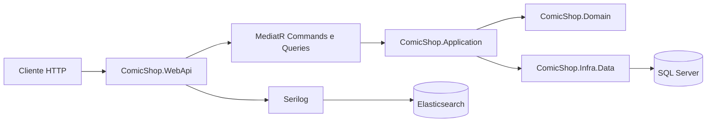

# ComicShop

API REST para estudo de arquitetura, separação de camadas e organização por features em .NET.

O projeto foi construído como laboratório pessoal para praticar conceitos como CQRS, MediatR, Entity Framework Core, autenticação com JWT, tratamento estruturado de erros e observabilidade com Serilog.

## Visão geral

O ComicShop modela uma loja de quadrinhos com três áreas principais:

- Publishers: cadastro, listagem e atualização de editoras.
- Comics: cadastro e consulta de quadrinhos.
- Users: criação de usuários e geração de token JWT.

Mais do que resolver apenas o domínio de negócio, a solução foi organizada para servir como base de estudo de arquitetura backend em .NET, com fronteiras bem definidas entre API, aplicação, domínio, infraestrutura e testes.

## Arquitetura

O desenho da solução combina camadas tradicionais com organização vertical por feature.



### Responsabilidade de cada projeto

| Projeto | Papel na solução |
| --- | --- |
| `ComicShop.WebApi` | Ponto de entrada HTTP, controllers, autenticação, Swagger, DI e pipeline da aplicação. |
| `ComicShop.Application` | Casos de uso por feature com Commands, Queries, Handlers, validação e orquestração. |
| `ComicShop.Domain` | Entidades e contratos de repositório. |
| `ComicShop.Infra.Data` | Persistência com EF Core, `DbContext`, migrations, mappings e repositórios. |
| `ComicShop.Infra` | Utilitários e helpers compartilhados. |
| `ComicShop.Infra.Structs` | Estruturas de apoio como `Result`, `Option` e `Unit`. |
| `ComicShop.Tests.Common` | Builders e helpers reutilizados nos testes. |
| `ComicShop.UnitTests` | Testes unitários dos casos de uso. |

### Organização por feature

As camadas principais são segmentadas pelos mesmos domínios funcionais:

- `Comics`
- `Publishers`
- `Users`

Esse padrão facilita estudar o fluxo completo de uma funcionalidade, do endpoint HTTP até a persistência.

## Stack e tecnologias

- .NET 9
- ASP.NET Core Web API
- Entity Framework Core 9 com SQL Server
- MediatR para Commands e Queries
- AutoMapper para mapeamento entre modelos
- FluentValidation para validação de entrada
- JWT Bearer Authentication
- Swagger / OpenAPI
- Serilog com console e Elasticsearch
- NUnit, Moq e FluentAssertions para testes unitários
- Docker e Docker Compose para execução local e apoio operacional

## Estrutura da solução

```text
ComicShop.sln
|-- ComicShop.WebApi/
|-- ComicShop.Application/
|-- ComicShop.Domain/
|-- ComicShop.Infra.Data/
|-- ComicShop.Infra/
|-- ComicShop.Infra.Structs/
|-- ComicShop.Tests.Common/
`-- ComicShop.UnitTests/
```

## Fluxo de uma request

Um fluxo típico da API segue esta sequência:

1. O controller recebe a requisição HTTP.
2. O controller envia um `Command` ou `Query` via `IMediator`.
3. O handler da camada `Application` aplica regras de negócio e interage com contratos do domínio.
4. A infraestrutura implementa os repositórios e persiste dados no SQL Server com EF Core.
5. A resposta volta para a API já no formato esperado para o cliente.

Esse fluxo pode ser visto, por exemplo, na funcionalidade de criação de editora, ligando controller, command handler, entidade de domínio e repositório.

## Como executar localmente

### Pré-requisitos

- .NET SDK 9
- SQL Server LocalDB ou SQL Server disponível
- Docker Desktop, se quiser subir a stack com containers

### Executando com `dotnet`

1. Restaure os pacotes:

```bash
dotnet restore
```

2. Suba a API:

```bash
dotnet run --project .\ComicShop.WebApi\ComicShop.WebApi.csproj
```

3. A aplicação local fica disponível, por padrão, em:

- `https://localhost:5001`
- `http://localhost:5000`
- Swagger: `https://localhost:5001/swagger`

4. Na primeira execução, configure também `Jwt` e `Bootstrap:Admin` para criar o primeiro usuário administrador de forma segura. O passo a passo está em `docs/local-setup.md`.

### Build da solução principal

```bash
dotnet build .\ComicShop.WebApi\ComicShop.WebApi.csproj /property:GenerateFullPaths=true /consoleloggerparameters:NoSummary
```

## Executando com Docker

O projeto contém mais de um compose para cenários diferentes.

### API + SQL Server

```bash
docker compose up --build
```

Esse compose sobe:

- SQL Server em `localhost:1433`
- API em `http://localhost:8080`

### Ferramentas de apoio

```bash
docker compose -f docker-compose.tools.yml up -d
```

Esse compose inclui serviços auxiliares para estudo e observabilidade:

- Elasticsearch
- Kibana
- SonarQube
- Portainer

## Configuração

As configurações principais ficam em `ComicShop.WebApi/appsettings.json`.

### Connection string padrão

```json
"ConnectionStrings": {
	"ComicShopContext": "Server=(localdb)\\mssqllocaldb;Database=ComicShop;Trusted_Connection=True;MultipleActiveResultSets=true"
}
```

### Elasticsearch

```json
"Elasticsearch": {
	"Uri": "http://localhost:9200"
}
```

## Endpoints principais

### Users

- `POST /v1/generate-token`: gera token JWT.
- `POST /v1/users`: cria usuário. Requer perfil `Admin`.

### Publishers

- `POST /v1/publishers`: cria editora.
- `GET /v1/publishers`: lista editoras.
- `PUT /v1/publishers`: atualiza editora.

### Comics

- `POST /v1/comics`: cria quadrinho.
- `GET /v1/comics`: lista quadrinhos.

## Segurança e autenticação

A API utiliza autenticação JWT Bearer. Depois de gerar o token, ele pode ser enviado no header:

```http
Authorization: Bearer {seu-token}
```

Os endpoints protegidos utilizam autorização por roles, com destaque para:

- `Default`
- `Admin`

Na primeira execução, o primeiro `Admin` pode ser criado automaticamente via configuração `Bootstrap:Admin`, evitando depender de credenciais padrão fixas.

## Testes

Os testes unitários estão concentrados em `ComicShop.UnitTests`, com apoio de builders em `ComicShop.Tests.Common`.

Para executar os testes:

```bash
dotnet test
```

## O que este projeto ajuda a estudar

- Separação de responsabilidades entre camadas
- CQRS com MediatR
- Organização vertical por feature
- Repositórios com EF Core
- Tratamento de erros em APIs REST
- Autenticação com JWT
- Documentação com Swagger
- Observabilidade com Serilog e Elasticsearch
- Testes unitários de handlers

## Próximos passos possíveis

Se a ideia for continuar usando o projeto como laboratório de arquitetura, alguns bons próximos assuntos são:

- validação cross-cutting com pipeline behaviors do MediatR
- testes de integração da Web API
- externalização completa de segredos e configurações sensíveis
- versionamento e evolução contratual dos endpoints
- métricas e tracing além do logging

## Licença

Uso pessoal e educacional.
